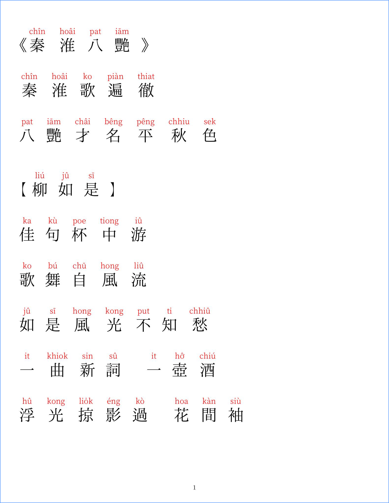
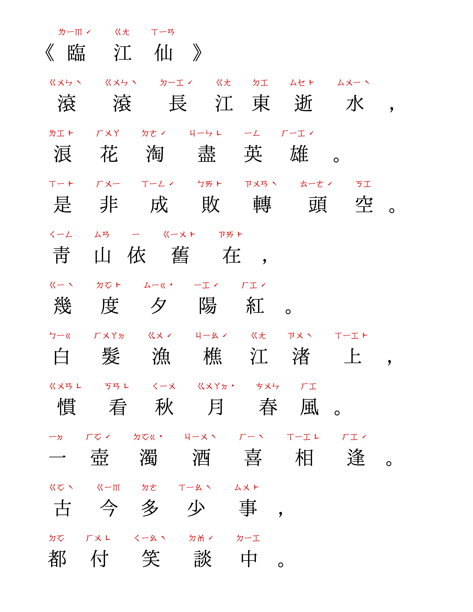
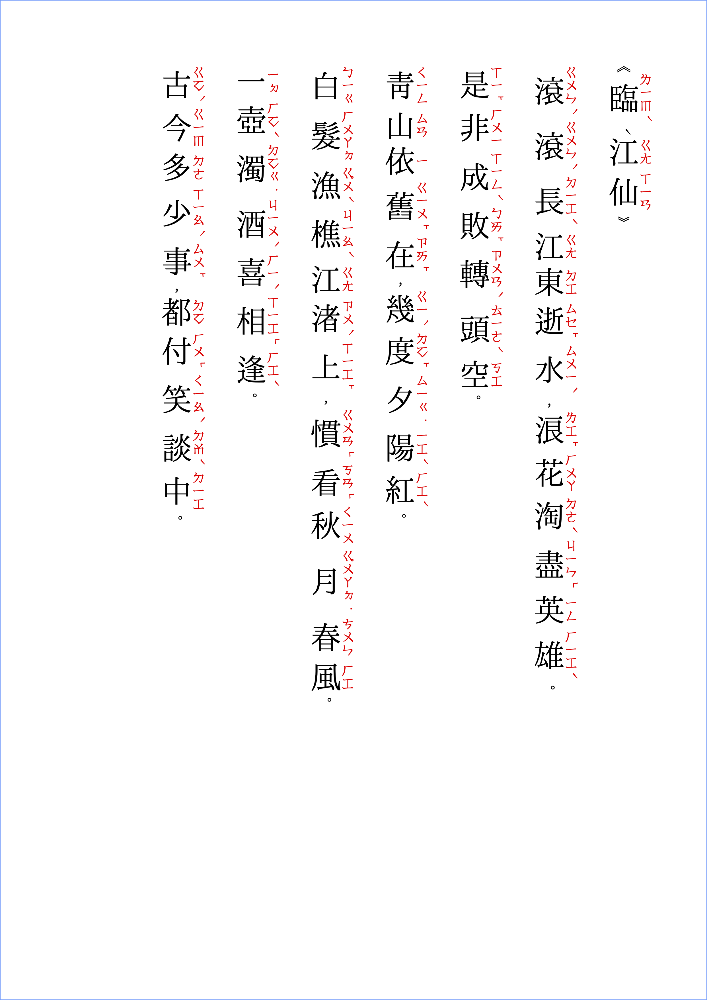

# 專案指引

為研究 LaTeX 是否可作為「河洛話」之「注音工具」，故而啟動本專案。

規劃中將使用之「注音／拼音系統」如下：
 - 彙雅集十五音
 - 白話字（教羅拼音）
 - 台羅拼音
 - 方音符號
 - 閩拼方案

預計將使用之「版面編排」，依「漢字」、「注音」之組合，將有如下應用：

## 文字橫排，注音於漢字上/下方

版面文字「橫排」，「注音」置於「漢字」之上方/下方：
 - 彙雅集十五音
 - 白話字（教羅拼音）
 - 台羅拼音
 - 方音符號
 - 閩拼方案

## 文字橫排，注音於漢字右側

版面文字「橫排」，「注音」置於「漢字」之右側：
 - 方音符號

## 文字直排，注音於漢字右側

版面文字「直排」，「注音」置於「漢字」之右側：
 - 方音符號

